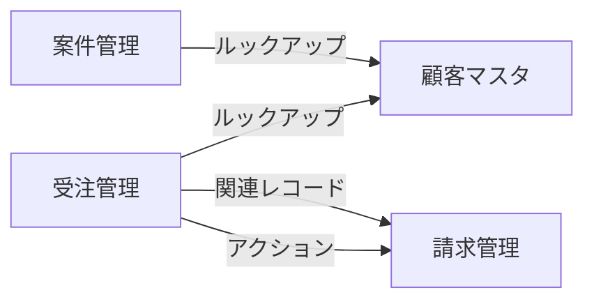

# sample-corp.cybozu.com kintone アプリ設計書

> **社外秘 — 本書には権限設定・担当者名が含まれます。取り扱いにご注意ください。**

| 項目 | 内容 |
|---|---|
| 生成日時 | 2026/09/19 23:22 |
| 対象アプリ数 | 19 件（取得済 19 / 権限なし 0） |
| 実行者 | joho-sys |
| 前回の走査 | 2026/09/19 23:13 |

本書は kintone の設定情報を取得・整形したものです。サイボウズ株式会社の公式製品ではありません。内容は取得時点の API 応答に基づきます。

---

## 前回（2026/09/19）からの変更

| アプリ | 変更 |
|---|---|
| 顧客マスタ（1） | ラベル変更 1（`address` 住所 → 請求先住所） |
| 日報（11） | 一覧追加 1（今週の日報）／JS/CSS 更新 2（`sample.js` / `sample.css`） |
| 在庫管理（14） | フィールド追加 1（`shelf_no` 棚番） |
| 社員名簿（16） | アクセス権変更 1（Everyone） |
| 備品貸出（23） | アプリ追加 1（備品貸出（23）） |
| 受注管理（3） | フィールド削除 1（`discount_reason` 値引理由） |

> 「誰が変更したか」は本書では判定していません。変更者を特定する場合は、kintone の監査ログをご確認ください。

---

## アプリ関係図

---

## 目次

1. [顧客マスタ（1）](#1-顧客マスタ1)
2. [請求管理（2）](#2-請求管理2)
3. [受注管理（3）](#3-受注管理3)
4. [見積管理（4）](#4-見積管理4)
5. [商品マスタ（5）](#5-商品マスタ5)
6. [備品管理（6）](#6-備品管理6)
7. [稟議申請（7）](#7-稟議申請7)
8. [問い合わせ管理（8）](#8-問い合わせ管理8)
9. [売上分析（9）](#9-売上分析9)
10. [出荷指示（10）](#10-出荷指示10)
11. [日報（11）](#11-日報11)
12. [経費精算（12）](#12-経費精算12)
13. [発注管理（13）](#13-発注管理13)
14. [在庫管理（14）](#14-在庫管理14)
15. [案件管理（15）](#15-案件管理15)
16. [社員名簿（16）](#16-社員名簿16)
17. [取引先ポータル（17）](#17-取引先ポータル17)
18. [アンケート集計（22）](#18-アンケート集計22)
19. [備品貸出（23）](#19-備品貸出23)

---

## 1. 顧客マスタ（1）

### 基本情報

| 項目 | 値 |
|---|---|
| アプリコード | （未設定） |
| スペース | （スペースに所属していません） |
| 説明 | （未設定） |
| アプリ作成日 | 2026/09/17 |
| 設定リビジョン | 8 |

### フィールド

| フィールド名 | フィールドコード | 種類 | 必須 | 補足 |
|---|---|---|---|---|
| 顧客コード | `customer_code` | 文字列（1行） | ✓ | 重複禁止 |
| 顧客名 | `customer_name` | 文字列（1行） | ✓ |  |
| 請求先住所 | `address` | 文字列（1行） | — |  |
| 備考 | `memo` | 文字列（複数行） | — |  |
| 担当者（カナ） | `legacy_glyph` | 文字列（1行） | — |  |
| 取引区分 | `rev_test` | 文字列（1行） | — |  |
| レコード番号 | `レコード番号` | レコード番号 | — |  |
| 作業者 | `作業者` | 作業者 | — |  |
| 更新者 | `更新者` | 更新者 | — |  |
| 作成者 | `作成者` | 作成者 | — |  |
| ステータス | `ステータス` | ステータス | — |  |
| 更新日時 | `更新日時` | 更新日時 | — |  |
| カテゴリー | `カテゴリー` | カテゴリー | — |  |
| 作成日時 | `作成日時` | 作成日時 | — |  |

フィールド数: 14

### 一覧

なし

### プロセス管理

**無効**

### アクセス権

**アプリのアクセス権**

| 対象 | 閲覧 | 追加 | 編集 | 削除 | アプリ管理 |
|---|---|---|---|---|---|
| アプリ作成者 | ✓ | ✓ | ✓ | ✓ | ✓ |
| Everyone | ✓ | ✓ | ✓ | ✓ | — |

**レコードのアクセス権**: なし
**フィールドのアクセス権**: なし

### JavaScript / CSS カスタマイズ

なし

### プラグイン

なし

### 通知

条件通知: 2 件 ／ レコード通知: 0 件 ／ リマインダー通知: 0 件

### アクション

なし

### グラフ

なし

### 参照されているアプリ

- 受注管理（3）: ルックアップ
- 案件管理（15）: ルックアップ

---

## 2. 請求管理（2）

### 基本情報

| 項目 | 値 |
|---|---|
| アプリコード | （未設定） |
| スペース | （スペースに所属していません） |
| 説明 | （未設定） |
| アプリ作成日 | 2026/09/17 |
| 設定リビジョン | 5 |

### フィールド

| フィールド名 | フィールドコード | 種類 | 必須 | 補足 |
|---|---|---|---|---|
| 受注番号 | `order_no` | 文字列（1行） | — | 重複禁止 |
| 請求金額（税込） | `amount` | 数値 | — | 単位: 円（後ろ） 桁区切りあり |
| 請求日 | `billing_date` | 日付 | — |  |
| カテゴリー | `カテゴリー` | カテゴリー | — |  |
| レコード番号 | `レコード番号` | レコード番号 | — |  |
| 作業者 | `作業者` | 作業者 | — |  |
| 更新者 | `更新者` | 更新者 | — |  |
| 作成者 | `作成者` | 作成者 | — |  |
| ステータス | `ステータス` | ステータス | — |  |
| 更新日時 | `更新日時` | 更新日時 | — |  |
| 作成日時 | `作成日時` | 作成日時 | — |  |

フィールド数: 11

### 一覧

なし

### プロセス管理

**無効**

### アクセス権

**アプリのアクセス権**

| 対象 | 閲覧 | 追加 | 編集 | 削除 | アプリ管理 |
|---|---|---|---|---|---|
| アプリ作成者 | ✓ | ✓ | ✓ | ✓ | ✓ |
| Everyone | ✓ | ✓ | ✓ | ✓ | — |

**レコードのアクセス権**: なし
**フィールドのアクセス権**: なし

### JavaScript / CSS カスタマイズ

なし

### プラグイン

なし

### 通知

条件通知: 2 件 ／ レコード通知: 0 件 ／ リマインダー通知: 0 件

### アクション

なし

### グラフ

なし

### 参照されているアプリ

- 受注管理（3）: 関連レコード
- 受注管理（3）: アクション

---

## 3. 受注管理（3）

### 基本情報

| 項目 | 値 |
|---|---|
| アプリコード | （未設定） |
| スペース | （スペースに所属していません） |
| 説明 | （未設定） |
| アプリ作成日 | 2026/09/17 |
| 設定リビジョン | 8 |

### フィールド

| フィールド名 | フィールドコード | 種類 | 必須 | 補足 |
|---|---|---|---|---|
| 受注番号 | `order_no` | 文字列（1行） | ✓ | 重複禁止 |
| 受注日 | `order_date` | 日付 | — |  |
| 顧客名 | `customer_name` | 文字列（1行） | — | **ルックアップ → 顧客マスタ（1）** キー: `customer_code` |
| 顧客コード | `customer_code_copy` | 文字列（1行） | — | ルックアップのコピー先 |
| 担当者 | `sales_person` | ユーザー選択 | — |  |
| ステータス | `status` | ドロップダウン | — | 選択肢: 受付 / 手配中 / 出荷済 / 完了 |
| 明細 | `details` | テーブル | — |  |
| 明細 > 商品名 | `item_name` | 文字列（1行） | — | テーブル「明細」内 |
| 明細 > 数量 | `item_qty` | 数値 | — | テーブル「明細」内 単位: 個（後ろ） |
| 明細 > 単価 | `item_price` | 数値 | — | テーブル「明細」内 桁区切りあり |
| 明細 > 小計 | `item_subtotal` | 計算 | — | テーブル「明細」内 計算式: `item_qty * item_price` 数値 |
| 合計金額 | `total` | 計算 | — | 計算式: `SUM(item_subtotal)` 数値 |
| 請求一覧 | `invoice_ref` | 関連レコード一覧 | — | **関連レコード → 請求管理（2）** 条件: `order_no` = `order_no` |
| レコード番号 | `レコード番号` | レコード番号 | — |  |
| 作業者 | `作業者` | 作業者 | — |  |
| 更新者 | `更新者` | 更新者 | — |  |
| 作成者 | `作成者` | 作成者 | — |  |
| ステータス | `ステータス` | ステータス | — |  |
| 更新日時 | `更新日時` | 更新日時 | — |  |
| カテゴリー | `カテゴリー` | カテゴリー | — |  |
| 作成日時 | `作成日時` | 作成日時 | — |  |

フィールド数: 21（うちテーブル内 4）

### 一覧

| 一覧名 | 種類 | 表示フィールド | 絞り込み | 並び順 |
|---|---|---|---|---|
| （作業者が自分） | 表形式 | レコード番号 / 受注番号 / 受注日 / 顧客名 / 顧客コード / 担当者 / ステータス / 合計金額 / ステータス / 作業者 | `作業者 in (LOGINUSER())` | `レコード番号` 降順 |

### プロセス管理

**有効**

| ステータス | 作業者 |
|---|---|
| 受付 | （作業者なし） |
| 手配中 | （作業者なし） |
| 出荷済 | （作業者なし） |
| 完了 | （作業者なし） |

| アクション | 遷移元 → 遷移先 | 実行条件 |
|---|---|---|
| 手配する | 受付 → 手配中 | — |
| 出荷する | 手配中 → 出荷済 | — |
| 差し戻す | 手配中 → 受付 | `status in ("手配中")` |
| 完了にする | 出荷済 → 完了 | — |

### アクセス権

**アプリのアクセス権**

| 対象 | 閲覧 | 追加 | 編集 | 削除 | アプリ管理 |
|---|---|---|---|---|---|
| アプリ作成者 | ✓ | ✓ | ✓ | ✓ | ✓ |
| Everyone | ✓ | ✓ | ✓ | ✓ | — |

**レコードのアクセス権**: なし
**フィールドのアクセス権**: なし

### JavaScript / CSS カスタマイズ

なし

### プラグイン

なし

### 通知

条件通知: 3 件 ／ レコード通知: 0 件 ／ リマインダー通知: 0 件

### アクション

| アクション名 | 遷移先アプリ | マッピング数 |
|---|---|---|
| 請求を作成する | 請求管理（2） | 1 |

### グラフ

なし

---

## 4. 見積管理（4）

### 基本情報

| 項目 | 値 |
|---|---|
| アプリコード | （未設定） |
| スペース | （スペースに所属していません） |
| 説明 | （未設定） |
| アプリ作成日 | 2026/09/17 |
| 設定リビジョン | 7 |

### フィールド

| フィールド名 | フィールドコード | 種類 | 必須 | 補足 |
|---|---|---|---|---|
| 見積件名 | `title` | 文字列（1行） | — |  |
| 詳細情報 | `info_group` | グループ | — |  |
| 詳細情報 > 有効期限メモ | `g_text` | 文字列（1行） | — |  |
| 詳細情報 > 値引率（％） | `g_num` | 数値 | — |  |
| カテゴリー | `カテゴリー` | カテゴリー | — |  |
| レコード番号 | `レコード番号` | レコード番号 | — |  |
| 作業者 | `作業者` | 作業者 | — |  |
| 更新者 | `更新者` | 更新者 | — |  |
| 作成者 | `作成者` | 作成者 | — |  |
| ステータス | `ステータス` | ステータス | — |  |
| 更新日時 | `更新日時` | 更新日時 | — |  |
| 作成日時 | `作成日時` | 作成日時 | — |  |

フィールド数: 12

### 一覧

なし

### プロセス管理

**無効**

### アクセス権

**アプリのアクセス権**

| 対象 | 閲覧 | 追加 | 編集 | 削除 | アプリ管理 |
|---|---|---|---|---|---|
| アプリ作成者 | ✓ | ✓ | ✓ | ✓ | ✓ |
| Everyone | ✓ | ✓ | ✓ | ✓ | — |

**レコードのアクセス権**: なし
**フィールドのアクセス権**: なし

### JavaScript / CSS カスタマイズ

なし

### プラグイン

なし

### 通知

条件通知: 2 件 ／ レコード通知: 0 件 ／ リマインダー通知: 0 件

### アクション

なし

### グラフ

なし

---

## 5. 商品マスタ（5）

### 基本情報

| 項目 | 値 |
|---|---|
| アプリコード | （未設定） |
| スペース | （スペースに所属していません） |
| 説明 | （未設定） |
| アプリ作成日 | 2026/09/17 |
| 設定リビジョン | 8 |

### フィールド

| フィールド名 | フィールドコード | 種類 | 必須 | 補足 |
|---|---|---|---|---|
| 商品名 | `name` | 文字列（1行） | — |  |
| 商品説明 | `note` | 文字列（複数行） | — |  |
| カテゴリー | `カテゴリー` | カテゴリー | — |  |
| レコード番号 | `レコード番号` | レコード番号 | — |  |
| 作業者 | `作業者` | 作業者 | — |  |
| 更新者 | `更新者` | 更新者 | — |  |
| 作成者 | `作成者` | 作成者 | — |  |
| ステータス | `ステータス` | ステータス | — |  |
| 更新日時 | `更新日時` | 更新日時 | — |  |
| 作成日時 | `作成日時` | 作成日時 | — |  |

フィールド数: 10

### 一覧

なし

### プロセス管理

**無効**

### アクセス権

**アプリのアクセス権**

| 対象 | 閲覧 | 追加 | 編集 | 削除 | アプリ管理 |
|---|---|---|---|---|---|
| アプリ作成者 | ✓ | ✓ | ✓ | ✓ | ✓ |
| Everyone | ✓ | ✓ | ✓ | ✓ | — |

**レコードのアクセス権**: なし
**フィールドのアクセス権**: なし

### JavaScript / CSS カスタマイズ

なし

### プラグイン

なし

### 通知

条件通知: 2 件 ／ レコード通知: 0 件 ／ リマインダー通知: 0 件

### アクション

なし

### グラフ

なし

---

## 6. 備品管理（6）

### 基本情報

| 項目 | 値 |
|---|---|
| アプリコード | （未設定） |
| スペース | （スペースに所属していません） |
| 説明 | （未設定） |
| アプリ作成日 | 2026/09/17 |
| 設定リビジョン | 5 |

### フィールド

| フィールド名 | フィールドコード | 種類 | 必須 | 補足 |
|---|---|---|---|---|
| 備品名 | `name` | 文字列（1行） | — |  |
| カテゴリー | `カテゴリー` | カテゴリー | — |  |
| レコード番号 | `レコード番号` | レコード番号 | — |  |
| 作業者 | `作業者` | 作業者 | — |  |
| 更新者 | `更新者` | 更新者 | — |  |
| 作成者 | `作成者` | 作成者 | — |  |
| ステータス | `ステータス` | ステータス | — |  |
| 更新日時 | `更新日時` | 更新日時 | — |  |
| 作成日時 | `作成日時` | 作成日時 | — |  |

フィールド数: 9

### 一覧

なし

### プロセス管理

**無効**

### アクセス権

**アプリのアクセス権**

| 対象 | 閲覧 | 追加 | 編集 | 削除 | アプリ管理 |
|---|---|---|---|---|---|
| アプリ作成者 | ✓ | ✓ | ✓ | ✓ | ✓ |
| Everyone | ✓ | ✓ | ✓ | ✓ | — |

**レコードのアクセス権**: なし
**フィールドのアクセス権**: なし

### JavaScript / CSS カスタマイズ

なし

### プラグイン

なし

### 通知

条件通知: 2 件 ／ レコード通知: 0 件 ／ リマインダー通知: 0 件

### アクション

なし

### グラフ

なし

---

## 7. 稟議申請（7）

### 基本情報

| 項目 | 値 |
|---|---|
| アプリコード | （未設定） |
| スペース | （スペースに所属していません） |
| 説明 | （未設定） |
| アプリ作成日 | 2026/09/17 |
| 設定リビジョン | 9 |

### フィールド

| フィールド名 | フィールドコード | 種類 | 必須 | 補足 |
|---|---|---|---|---|
| 稟議件名 | `name` | 文字列（1行） | — |  |
| 申請金額 | `secret_amount` | 数値 | — | 桁区切りあり |
| 申請者 | `owner` | ユーザー選択 | — |  |
| カテゴリー | `カテゴリー` | カテゴリー | — |  |
| レコード番号 | `レコード番号` | レコード番号 | — |  |
| 作業者 | `作業者` | 作業者 | — |  |
| 更新者 | `更新者` | 更新者 | — |  |
| 作成者 | `作成者` | 作成者 | — |  |
| ステータス | `ステータス` | ステータス | — |  |
| 更新日時 | `更新日時` | 更新日時 | — |  |
| 作成日時 | `作成日時` | 作成日時 | — |  |

フィールド数: 11

### 一覧

なし

### プロセス管理

**無効**

### アクセス権

**アプリのアクセス権**

| 対象 | 閲覧 | 追加 | 編集 | 削除 | アプリ管理 |
|---|---|---|---|---|---|
| グループ: Administrators | ✓ | ✓ | ✓ | ✓ | ✓ |
| Everyone | ✓ | ✓ | ✓ | ✓ | — |

**レコードのアクセス権**: 1 件（条件: `name = "機密案件"`）
**フィールドのアクセス権**: 1 件（`secret_amount` — Everyone は 閲覧と編集は不可）

### JavaScript / CSS カスタマイズ

なし

### プラグイン

なし

### 通知

条件通知: 2 件 ／ レコード通知: 0 件 ／ リマインダー通知: 0 件

### アクション

なし

### グラフ

なし

---

## 8. 問い合わせ管理（8）

### 基本情報

| 項目 | 値 |
|---|---|
| アプリコード | （未設定） |
| スペース | （スペースに所属していません） |
| 説明 | （未設定） |
| アプリ作成日 | 2026/09/17 |
| 設定リビジョン | 8 |

### フィールド

| フィールド名 | フィールドコード | 種類 | 必須 | 補足 |
|---|---|---|---|---|
| 件名 | `name` | 文字列（1行） | — |  |
| 回答期限 | `due_date` | 日付 | — |  |
| 担当者 | `assignee` | ユーザー選択 | — |  |
| カテゴリー | `カテゴリー` | カテゴリー | — |  |
| レコード番号 | `レコード番号` | レコード番号 | — |  |
| 作業者 | `作業者` | 作業者 | — |  |
| 更新者 | `更新者` | 更新者 | — |  |
| 作成者 | `作成者` | 作成者 | — |  |
| ステータス | `ステータス` | ステータス | — |  |
| 更新日時 | `更新日時` | 更新日時 | — |  |
| 作成日時 | `作成日時` | 作成日時 | — |  |

フィールド数: 11

### 一覧

なし

### プロセス管理

**無効**

### アクセス権

**アプリのアクセス権**

| 対象 | 閲覧 | 追加 | 編集 | 削除 | アプリ管理 |
|---|---|---|---|---|---|
| アプリ作成者 | ✓ | ✓ | ✓ | ✓ | ✓ |
| Everyone | ✓ | ✓ | ✓ | ✓ | — |

**レコードのアクセス権**: なし
**フィールドのアクセス権**: なし

### JavaScript / CSS カスタマイズ

なし

### プラグイン

なし

### 通知

条件通知: 1 件 ／ レコード通知: 1 件 ／ リマインダー通知: 1 件

### アクション

なし

### グラフ

なし

---

## 9. 売上分析（9）

### 基本情報

| 項目 | 値 |
|---|---|
| アプリコード | （未設定） |
| スペース | （スペースに所属していません） |
| 説明 | （未設定） |
| アプリ作成日 | 2026/09/17 |
| 設定リビジョン | 6 |

### フィールド

| フィールド名 | フィールドコード | 種類 | 必須 | 補足 |
|---|---|---|---|---|
| 商品カテゴリ | `category` | 文字列（1行） | — |  |
| 売上金額 | `value` | 数値 | — |  |
| 計上日 | `recorded_on` | 日付 | — |  |
| カテゴリー | `カテゴリー` | カテゴリー | — |  |
| レコード番号 | `レコード番号` | レコード番号 | — |  |
| 作業者 | `作業者` | 作業者 | — |  |
| 更新者 | `更新者` | 更新者 | — |  |
| 作成者 | `作成者` | 作成者 | — |  |
| ステータス | `ステータス` | ステータス | — |  |
| 更新日時 | `更新日時` | 更新日時 | — |  |
| 作成日時 | `作成日時` | 作成日時 | — |  |

フィールド数: 11

### 一覧

なし

### プロセス管理

**無効**

### アクセス権

**アプリのアクセス権**

| 対象 | 閲覧 | 追加 | 編集 | 削除 | アプリ管理 |
|---|---|---|---|---|---|
| アプリ作成者 | ✓ | ✓ | ✓ | ✓ | ✓ |
| Everyone | ✓ | ✓ | ✓ | ✓ | — |

**レコードのアクセス権**: なし
**フィールドのアクセス権**: なし

### JavaScript / CSS カスタマイズ

なし

### プラグイン

なし

### 通知

条件通知: 2 件 ／ レコード通知: 0 件 ／ リマインダー通知: 0 件

### アクション

なし

### グラフ

| グラフ名 | 種類 |
|---|---|
| 分類別の件数 | 横棒グラフ |
| 月次の推移 | 折れ線グラフ |

---

## 10. 出荷指示（10）

### 基本情報

| 項目 | 値 |
|---|---|
| アプリコード | （未設定） |
| スペース | （スペースに所属していません） |
| 説明 | （未設定） |
| アプリ作成日 | 2026/09/17 |
| 設定リビジョン | 7 |

### フィールド

| フィールド名 | フィールドコード | 種類 | 必須 | 補足 |
|---|---|---|---|---|
| 出荷先 | `name` | 文字列（1行） | — |  |
| カテゴリー | `カテゴリー` | カテゴリー | — |  |
| レコード番号 | `レコード番号` | レコード番号 | — |  |
| 作業者 | `作業者` | 作業者 | — |  |
| 更新者 | `更新者` | 更新者 | — |  |
| 作成者 | `作成者` | 作成者 | — |  |
| ステータス | `ステータス` | ステータス | — |  |
| 更新日時 | `更新日時` | 更新日時 | — |  |
| 作成日時 | `作成日時` | 作成日時 | — |  |

フィールド数: 9

### 一覧

| 一覧名 | 種類 | 表示フィールド | 絞り込み | 並び順 |
|---|---|---|---|---|
| 一覧 | 表形式 | 出荷先 | — | `レコード番号` 降順 |
| カスタム一覧 | カスタマイズ形式 | — | — | `レコード番号` 降順 |
| 本日出荷分 | 表形式 | 出荷先 | — | `レコード番号` 降順 |

### プロセス管理

**無効**

### アクセス権

**アプリのアクセス権**

| 対象 | 閲覧 | 追加 | 編集 | 削除 | アプリ管理 |
|---|---|---|---|---|---|
| アプリ作成者 | ✓ | ✓ | ✓ | ✓ | ✓ |
| Everyone | ✓ | ✓ | ✓ | ✓ | — |

**レコードのアクセス権**: なし
**フィールドのアクセス権**: なし

### JavaScript / CSS カスタマイズ

なし

### プラグイン

なし

### 通知

条件通知: 2 件 ／ レコード通知: 0 件 ／ リマインダー通知: 0 件

### アクション

なし

### グラフ

なし

---

## 11. 日報（11）

### 基本情報

| 項目 | 値 |
|---|---|
| アプリコード | （未設定） |
| スペース | （スペースに所属していません） |
| 説明 | （未設定） |
| アプリ作成日 | 2026/09/17 |
| 設定リビジョン | 7 |

### フィールド

| フィールド名 | フィールドコード | 種類 | 必須 | 補足 |
|---|---|---|---|---|
| 報告者 | `name` | 文字列（1行） | — |  |
| カテゴリー | `カテゴリー` | カテゴリー | — |  |
| レコード番号 | `レコード番号` | レコード番号 | — |  |
| 作業者 | `作業者` | 作業者 | — |  |
| 更新者 | `更新者` | 更新者 | — |  |
| 作成者 | `作成者` | 作成者 | — |  |
| ステータス | `ステータス` | ステータス | — |  |
| 更新日時 | `更新日時` | 更新日時 | — |  |
| 作成日時 | `作成日時` | 作成日時 | — |  |

フィールド数: 9

### 一覧

| 一覧名 | 種類 | 表示フィールド | 絞り込み | 並び順 |
|---|---|---|---|---|
| 今週の日報 | 表形式 | 報告者 | — | `レコード番号` 降順 |

### プロセス管理

**無効**

### アクセス権

**アプリのアクセス権**

| 対象 | 閲覧 | 追加 | 編集 | 削除 | アプリ管理 |
|---|---|---|---|---|---|
| アプリ作成者 | ✓ | ✓ | ✓ | ✓ | ✓ |
| Everyone | ✓ | ✓ | ✓ | ✓ | — |

**レコードのアクセス権**: なし
**フィールドのアクセス権**: なし

### JavaScript / CSS カスタマイズ

適用範囲: **すべてのユーザー**

| 画面 | 種別 | ファイル / URL |
|---|---|---|
| PC | JS | `sample.js`（アップロード） |
| PC | CSS | `sample.css`（アップロード） |
| モバイル | — | なし |

### プラグイン

なし

### 通知

条件通知: 2 件 ／ レコード通知: 0 件 ／ リマインダー通知: 0 件

### アクション

なし

### グラフ

なし

---

## 12. 経費精算（12）

### 基本情報

| 項目 | 値 |
|---|---|
| アプリコード | （未設定） |
| スペース | （スペースに所属していません） |
| 説明 | （未設定） |
| アプリ作成日 | 2026/09/17 |
| 設定リビジョン | 6 |

### フィールド

| フィールド名 | フィールドコード | 種類 | 必須 | 補足 |
|---|---|---|---|---|
| 精算件名 | `name` | 文字列（1行） | — |  |
| カテゴリー | `カテゴリー` | カテゴリー | — |  |
| レコード番号 | `レコード番号` | レコード番号 | — |  |
| 作業者 | `作業者` | 作業者 | — |  |
| 更新者 | `更新者` | 更新者 | — |  |
| 作成者 | `作成者` | 作成者 | — |  |
| ステータス | `ステータス` | ステータス | — |  |
| 更新日時 | `更新日時` | 更新日時 | — |  |
| 作成日時 | `作成日時` | 作成日時 | — |  |

フィールド数: 9

### 一覧

なし

### プロセス管理

**無効**

### アクセス権

**アプリのアクセス権**

| 対象 | 閲覧 | 追加 | 編集 | 削除 | アプリ管理 |
|---|---|---|---|---|---|
| アプリ作成者 | ✓ | ✓ | ✓ | ✓ | ✓ |
| Everyone | ✓ | ✓ | ✓ | ✓ | — |

**レコードのアクセス権**: なし
**フィールドのアクセス権**: なし

### JavaScript / CSS カスタマイズ

適用範囲: **すべてのユーザー**

| 画面 | 種別 | ファイル / URL |
|---|---|---|
| PC | JS | `https://cdn.example.com/kintone/sample.js` |
| PC | CSS | `https://cdn.example.com/kintone/sample.css` |
| モバイル | — | なし |

### プラグイン

なし

### 通知

条件通知: 2 件 ／ レコード通知: 0 件 ／ リマインダー通知: 0 件

### アクション

なし

### グラフ

なし

---

## 13. 発注管理（13）

### 基本情報

| 項目 | 値 |
|---|---|
| アプリコード | （未設定） |
| スペース | （スペースに所属していません） |
| 説明 | （未設定） |
| アプリ作成日 | 2026/09/17 |
| 設定リビジョン | 7 |

### フィールド

| フィールド名 | フィールドコード | 種類 | 必須 | 補足 |
|---|---|---|---|---|
| 発注先 | `name` | 文字列（1行） | — |  |
| カテゴリー | `カテゴリー` | カテゴリー | — |  |
| レコード番号 | `レコード番号` | レコード番号 | — |  |
| 作業者 | `作業者` | 作業者 | — |  |
| 更新者 | `更新者` | 更新者 | — |  |
| 作成者 | `作成者` | 作成者 | — |  |
| ステータス | `ステータス` | ステータス | — |  |
| 更新日時 | `更新日時` | 更新日時 | — |  |
| 作成日時 | `作成日時` | 作成日時 | — |  |

フィールド数: 9

### 一覧

なし

### プロセス管理

**無効**

### アクセス権

**アプリのアクセス権**

| 対象 | 閲覧 | 追加 | 編集 | 削除 | アプリ管理 |
|---|---|---|---|---|---|
| アプリ作成者 | ✓ | ✓ | ✓ | ✓ | ✓ |
| Everyone | ✓ | ✓ | ✓ | ✓ | — |

**レコードのアクセス権**: なし
**フィールドのアクセス権**: なし

### JavaScript / CSS カスタマイズ

なし

### プラグイン

| プラグイン名 | バージョン | 有効 |
|---|---|---|
| メールスレッド表示 | 1.0.2 | ✓ |
| メール作成 | 1.0.3 | — |

### 通知

条件通知: 2 件 ／ レコード通知: 0 件 ／ リマインダー通知: 0 件

### アクション

なし

### グラフ

なし

---

## 14. 在庫管理（14）

### 基本情報

| 項目 | 値 |
|---|---|
| アプリコード | （未設定） |
| スペース | （スペースに所属していません） |
| 説明 | （未設定） |
| アプリ作成日 | 2026/09/17 |
| 設定リビジョン | 6 |

### フィールド

| フィールド名 | フィールドコード | 種類 | 必須 | 補足 |
|---|---|---|---|---|
| 品番 | `t_text` | 文字列（1行） | — |  |
| 保管メモ | `t_multi` | 文字列（複数行） | — |  |
| 在庫数 | `t_num` | 数値 | — |  |
| 棚卸日 | `t_date` | 日付 | — |  |
| 保管区分 | `t_drop` | ドロップダウン | — | 選択肢: A / B / C |
| 管理担当 | `t_user` | ユーザー選択 | — |  |
| 写真 | `t_file` | 添付ファイル | — |  |
| 在庫金額 | `t_calc` | 計算 | — | 計算式: `t_num * 2` 数値 |
| 棚番 | `shelf_no` | 文字列（1行） | — |  |
| レコード番号 | `レコード番号` | レコード番号 | — |  |
| 作業者 | `作業者` | 作業者 | — |  |
| 更新者 | `更新者` | 更新者 | — |  |
| 作成者 | `作成者` | 作成者 | — |  |
| ステータス | `ステータス` | ステータス | — |  |
| 更新日時 | `更新日時` | 更新日時 | — |  |
| カテゴリー | `カテゴリー` | カテゴリー | — |  |
| 作成日時 | `作成日時` | 作成日時 | — |  |

フィールド数: 17

### 一覧

なし

### プロセス管理

**無効**

### アクセス権

**アプリのアクセス権**

| 対象 | 閲覧 | 追加 | 編集 | 削除 | アプリ管理 |
|---|---|---|---|---|---|
| アプリ作成者 | ✓ | ✓ | ✓ | ✓ | ✓ |
| Everyone | ✓ | ✓ | ✓ | ✓ | — |

**レコードのアクセス権**: なし
**フィールドのアクセス権**: なし

### JavaScript / CSS カスタマイズ

なし

### プラグイン

なし

### 通知

条件通知: 2 件 ／ レコード通知: 0 件 ／ リマインダー通知: 0 件

### アクション

なし

### グラフ

なし

---

## 15. 案件管理（15）

### 基本情報

| 項目 | 値 |
|---|---|
| アプリコード | （未設定） |
| スペース | （スペースに所属していません） |
| 説明 | （未設定） |
| アプリ作成日 | 2026/09/17 |
| 設定リビジョン | 4 |

### フィールド

| フィールド名 | フィールドコード | 種類 | 必須 | 補足 |
|---|---|---|---|---|
| 案件番号 | `project_no` | 文字列（1行） | — | 重複禁止 |
| 顧客名 | `customer_name2` | 文字列（1行） | — | **ルックアップ → 顧客マスタ（1）** キー: `customer_code` |
| 顧客コード | `customer_code2` | 文字列（1行） | — | ルックアップのコピー先 |
| フェーズ | `phase` | ドロップダウン | — | 選択肢: 引合 / 提案 / 見積 / 受注 |
| カテゴリー | `カテゴリー` | カテゴリー | — |  |
| レコード番号 | `レコード番号` | レコード番号 | — |  |
| 作業者 | `作業者` | 作業者 | — |  |
| 更新者 | `更新者` | 更新者 | — |  |
| 作成者 | `作成者` | 作成者 | — |  |
| ステータス | `ステータス` | ステータス | — |  |
| 更新日時 | `更新日時` | 更新日時 | — |  |
| 作成日時 | `作成日時` | 作成日時 | — |  |

フィールド数: 12

### 一覧

なし

### プロセス管理

**無効**

### アクセス権

**アプリのアクセス権**

| 対象 | 閲覧 | 追加 | 編集 | 削除 | アプリ管理 |
|---|---|---|---|---|---|
| アプリ作成者 | ✓ | ✓ | ✓ | ✓ | ✓ |
| Everyone | ✓ | ✓ | ✓ | ✓ | — |

**レコードのアクセス権**: なし
**フィールドのアクセス権**: なし

### JavaScript / CSS カスタマイズ

なし

### プラグイン

なし

### 通知

条件通知: 2 件 ／ レコード通知: 0 件 ／ リマインダー通知: 0 件

### アクション

なし

### グラフ

なし

---

## 16. 社員名簿（16）

### 基本情報

| 項目 | 値 |
|---|---|
| アプリコード | （未設定） |
| スペース | （スペースに所属していません） |
| 説明 | （未設定） |
| アプリ作成日 | 2026/09/18 |
| 設定リビジョン | 6 |

### フィールド

| フィールド名 | フィールドコード | 種類 | 必須 | 補足 |
|---|---|---|---|---|
| 氏名 | `name` | 文字列（1行） | — |  |
| カテゴリー | `カテゴリー` | カテゴリー | — |  |
| レコード番号 | `レコード番号` | レコード番号 | — |  |
| 作業者 | `作業者` | 作業者 | — |  |
| 更新者 | `更新者` | 更新者 | — |  |
| 作成者 | `作成者` | 作成者 | — |  |
| ステータス | `ステータス` | ステータス | — |  |
| 更新日時 | `更新日時` | 更新日時 | — |  |
| 作成日時 | `作成日時` | 作成日時 | — |  |

フィールド数: 9

### 一覧

なし

### プロセス管理

**無効**

### アクセス権

**アプリのアクセス権**

| 対象 | 閲覧 | 追加 | 編集 | 削除 | アプリ管理 |
|---|---|---|---|---|---|
| アプリ作成者 | ✓ | ✓ | ✓ | ✓ | ✓ |
| Everyone | ✓ | ✓ | ✓ | ✓ | ✓ |

**レコードのアクセス権**: なし
**フィールドのアクセス権**: なし

### JavaScript / CSS カスタマイズ

なし

### プラグイン

なし

### 通知

条件通知: 2 件 ／ レコード通知: 0 件 ／ リマインダー通知: 0 件

### アクション

なし

### グラフ

なし

---

## 17. 取引先ポータル（17）

### 基本情報

| 項目 | 値 |
|---|---|
| アプリコード | （未設定） |
| スペース | 1 |
| 説明 | （未設定） |
| アプリ作成日 | 2026/09/18 |
| 設定リビジョン | 4 |

### フィールド

| フィールド名 | フィールドコード | 種類 | 必須 | 補足 |
|---|---|---|---|---|
| 名称 | `name` | 文字列（1行） | — |  |
| メモ | `memo` | 文字列（複数行） | — |  |
| カテゴリー | `カテゴリー` | カテゴリー | — |  |
| レコード番号 | `レコード番号` | レコード番号 | — |  |
| 作業者 | `作業者` | 作業者 | — |  |
| 更新者 | `更新者` | 更新者 | — |  |
| 作成者 | `作成者` | 作成者 | — |  |
| ステータス | `ステータス` | ステータス | — |  |
| 更新日時 | `更新日時` | 更新日時 | — |  |
| 作成日時 | `作成日時` | 作成日時 | — |  |

フィールド数: 10

### 一覧

なし

### プロセス管理

**無効**

### アクセス権

**アプリのアクセス権**

| 対象 | 閲覧 | 追加 | 編集 | 削除 | アプリ管理 |
|---|---|---|---|---|---|
| アプリ作成者 | ✓ | ✓ | ✓ | ✓ | ✓ |
| Everyone | ✓ | ✓ | ✓ | ✓ | — |

**レコードのアクセス権**: なし
**フィールドのアクセス権**: なし

### JavaScript / CSS カスタマイズ

なし

### プラグイン

なし

### 通知

条件通知: 2 件 ／ レコード通知: 0 件 ／ リマインダー通知: 0 件

### アクション

なし

### グラフ

なし

---

## 18. アンケート集計（22）

### 基本情報

| 項目 | 値 |
|---|---|
| アプリコード | （未設定） |
| スペース | （スペースに所属していません） |
| 説明 | （未設定） |
| アプリ作成日 | 2026/09/19 |
| 設定リビジョン | 3 |

### フィールド

| フィールド名 | フィールドコード | 種類 | 必須 | 補足 |
|---|---|---|---|---|
| アンケート名 | `title` | 文字列（1行） | — |  |
| 回答日 | `answered_on` | 日付 | — |  |
| 満足度 | `score` | 数値 | — |  |
| カテゴリー | `カテゴリー` | カテゴリー | — |  |
| レコード番号 | `レコード番号` | レコード番号 | — |  |
| 作業者 | `作業者` | 作業者 | — |  |
| 更新者 | `更新者` | 更新者 | — |  |
| 作成者 | `作成者` | 作成者 | — |  |
| ステータス | `ステータス` | ステータス | — |  |
| 更新日時 | `更新日時` | 更新日時 | — |  |
| 作成日時 | `作成日時` | 作成日時 | — |  |

フィールド数: 11

### 一覧

なし

### プロセス管理

**無効**

### アクセス権

**アプリのアクセス権**

| 対象 | 閲覧 | 追加 | 編集 | 削除 | アプリ管理 |
|---|---|---|---|---|---|
| アプリ作成者 | ✓ | ✓ | ✓ | ✓ | ✓ |
| Everyone | ✓ | ✓ | ✓ | ✓ | — |

**レコードのアクセス権**: なし
**フィールドのアクセス権**: なし

### JavaScript / CSS カスタマイズ

なし

### プラグイン

なし

### 通知

条件通知: 2 件 ／ レコード通知: 0 件 ／ リマインダー通知: 0 件

### アクション

なし

### グラフ

なし

---

## 19. 備品貸出（23）

> **このアプリは前回の走査時点では存在しませんでした（新規追加）。**

### 基本情報

| 項目 | 値 |
|---|---|
| アプリコード | （未設定） |
| スペース | （スペースに所属していません） |
| 説明 | （未設定） |
| アプリ作成日 | 2026/09/19 |
| 設定リビジョン | 3 |

### フィールド

| フィールド名 | フィールドコード | 種類 | 必須 | 補足 |
|---|---|---|---|---|
| 貸出品 | `item` | 文字列（1行） | — |  |
| 借用者 | `borrower` | ユーザー選択 | — |  |
| 返却予定日 | `due` | 日付 | — |  |
| カテゴリー | `カテゴリー` | カテゴリー | — |  |
| レコード番号 | `レコード番号` | レコード番号 | — |  |
| 作業者 | `作業者` | 作業者 | — |  |
| 更新者 | `更新者` | 更新者 | — |  |
| 作成者 | `作成者` | 作成者 | — |  |
| ステータス | `ステータス` | ステータス | — |  |
| 更新日時 | `更新日時` | 更新日時 | — |  |
| 作成日時 | `作成日時` | 作成日時 | — |  |

フィールド数: 11

### 一覧

なし

### プロセス管理

**無効**

### アクセス権

**アプリのアクセス権**

| 対象 | 閲覧 | 追加 | 編集 | 削除 | アプリ管理 |
|---|---|---|---|---|---|
| アプリ作成者 | ✓ | ✓ | ✓ | ✓ | ✓ |
| Everyone | ✓ | ✓ | ✓ | ✓ | — |

**レコードのアクセス権**: なし
**フィールドのアクセス権**: なし

### JavaScript / CSS カスタマイズ

なし

### プラグイン

なし

### 通知

条件通知: 2 件 ／ レコード通知: 0 件 ／ リマインダー通知: 0 件

### アクション

なし

### グラフ

なし

---

## 付録: 出力に関する注記

- 「（未設定）」は kintone 側で値が設定されていないことを示します
- 「なし」は設定が0件であることを示します。取得できなかった場合は「（取得できませんでした）」と表示されます
- カスタムビューの HTML、通知の条件式、計算式以外の詳細設定は本書に含まれません
- 日付は `YYYY/MM/DD` 形式です
